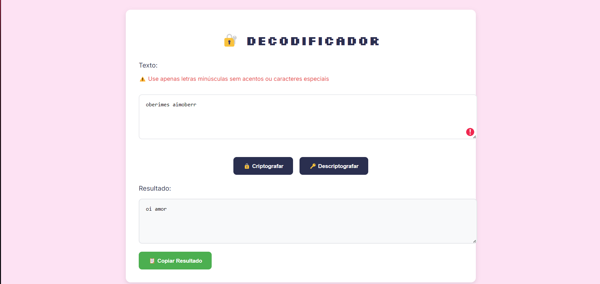

# 🔐 Decodificador de Texto - Challenge ONE

[](LICENSE)
[](https://camylla-ops.github.io/Challenge-ONE-L-gica-de-Programa-o-Decodificador-de-texto/)
[](https://github.com/camylla-ops/Challenge-ONE-L-gica-de-Programa-o-Decodificador-de-texto/)
[](https://developer.mozilla.org/pt-BR/docs/Web/HTML)
[](https://developer.mozilla.org/pt-BR/docs/Web/CSS)
[](https://developer.mozilla.org/pt-BR/docs/Web/JavaScript)

Uma ferramenta web para criptografia e descriptografia de textos desenvolvida como solução para o Challenge ONE da Oracle + Alura.



## ✨ Funcionalidades

- Criptografia de texto com substituições específicas:
  - `e` → `enter`
  - `i` → `imes`
  - `a` → `ai`
  - `o` → `ober`
  - `u` → `ufat`
- Descriptografia de texto codificado
- Validação de entrada (apenas letras minúsculas sem acentos)
- Funcionalidade de copiar resultado
- Design responsivo
- Interface intuitiva e amigável

## 🚀 Como Usar

### Pré-requisitos
- Navegador moderno (Chrome, Firefox, Edge)

### Instalação
```bash
git clone https://github.com/camylla-ops/Challenge-ONE-L-gica-de-Programa-o-Decodificador-de-texto.git
cd Challenge-ONE-L-gica-de-Programa-o-Decodificador-de-texto
